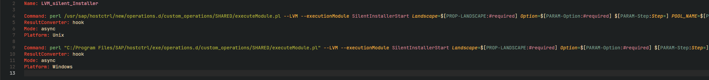
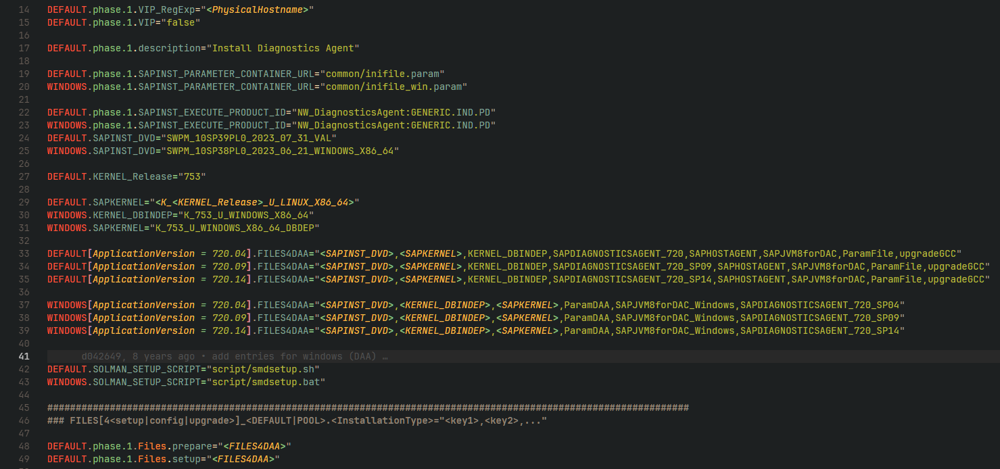
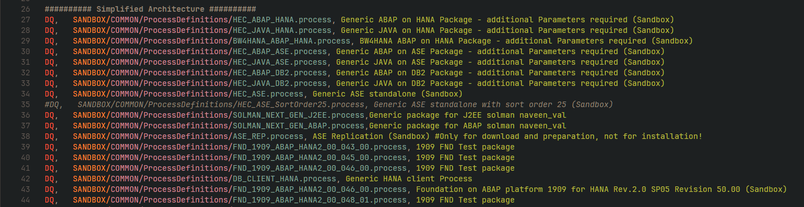
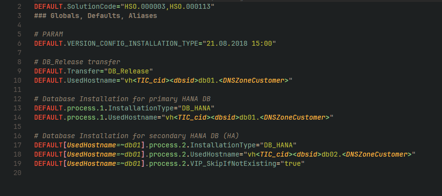

SAP specific file Syntax Highlighting (Lama Conf, SilentInstaller config|menu|param|process|properties)
=================================================================================================

Installation
------------

1. Copy extension to .vscode/extension
2. Restart VS Code
3. Enjoy

Examples with [Gruvbox](https://marketplace.visualstudio.com/items?itemName=jdinhlife.gruvbox) theme
------------------------------------
Lama .conf

SilentInstaller .config

SilentInstaller .menu

SilentInstaller .process

Scopes added
------------
source.lama.conf
source.sapinst
